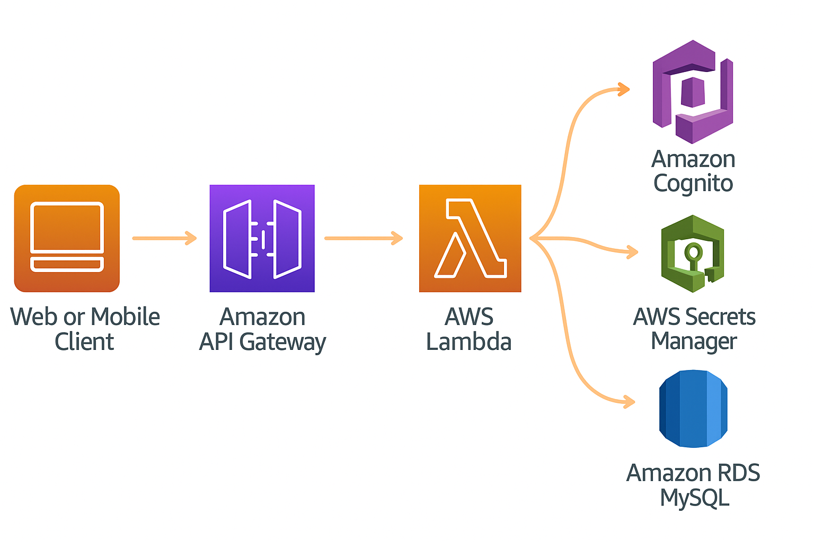

# 🛍️ E-commerce Backend (Serverless AWS + Go)

Este proyecto implementa el backend de una aplicación de e-commerce utilizando una arquitectura serverless en AWS, escrita completamente en Go. La API expone endpoints HTTP seguros mediante AWS API Gateway, gestionando autenticación con Cognito y configuraciones sensibles con Secrets Manager.

---

## 🚀 Tecnologías principales

- **AWS Lambda** – Funciones serverless que gestionan la lógica de negocio.
- **AWS API Gateway** – Expone rutas RESTful seguras.
- **AWS Cognito** – Autenticación de usuarios por token JWT.
- **AWS Secrets Manager** – Gestión de credenciales (MySQL, claves, etc.).
- **MySQL** – Base de datos relacional.
- **Go (Golang)** – Lenguaje principal de desarrollo backend.

---



---

## 🔐 Autenticación y Seguridad

- Los usuarios deben enviar su token en el header `x-auth` como `Bearer <token>`.
- Las rutas `/product [GET]` y `/category [GET]` son públicas.
- El resto de rutas requieren autenticación con tokens válidos (Cognito).
- Se realiza verificación básica del token con `auth.ValidoToken()`.

---

## 🗃️ Base de Datos y Roles

- Se accede a MySQL usando credenciales seguras cargadas dinámicamente desde AWS Secrets Manager.
- La tabla `category` permite insertar categorías mediante el endpoint `/category [POST]`, pero sólo si el usuario tiene rol administrador.
- `UserIsAdmin()` verifica si el `Username` extraído del token JWT tiene permisos de administrador en BBDD.

---

## 📬 Ejemplo de Petición

### Crear una categoría (requiere token válido)

POST /category
Headers:
x-auth: Bearer eyJraWQiOiJ... (token JWT válido)
Body:
{
"CategName": "Deportes",
"CategPath": "/deportes"
}


Respuesta:

```json
{
  "CategID": 6
}´´´

## Variables de entorno necesarias
SecretName=my-secret
UserPoolId=eu-west-1_example
Region=eu-west-1
UrlPrefix=/api
Usar herramientas como sam local invoke o Postman para pruebas de rutas.